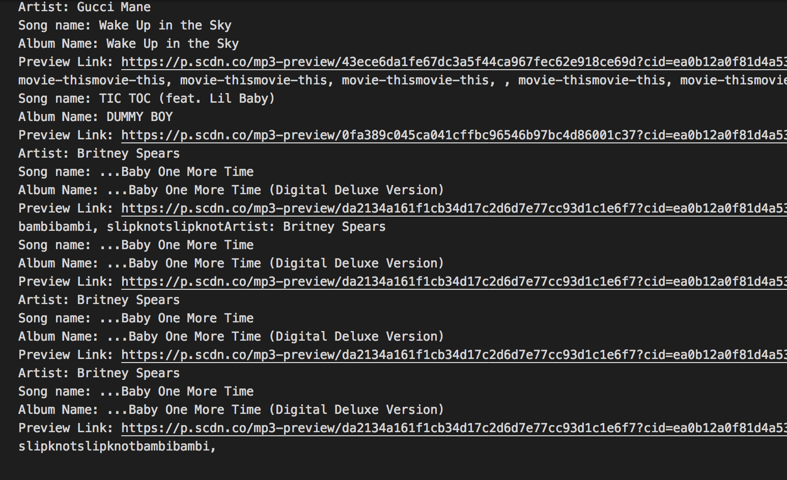
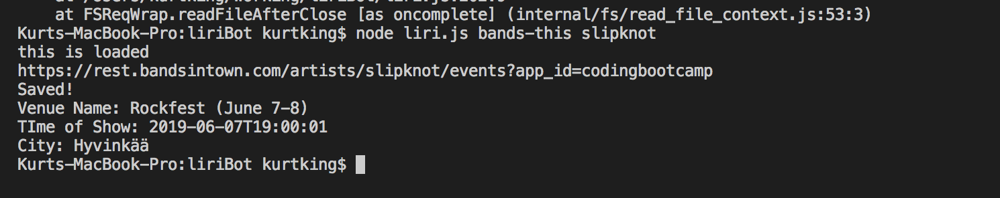
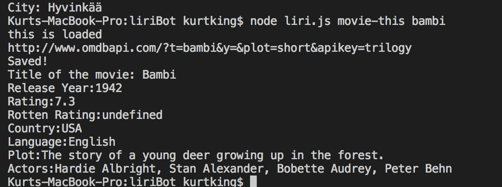
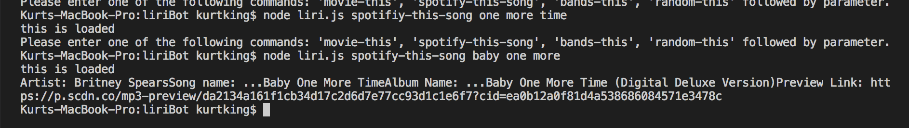
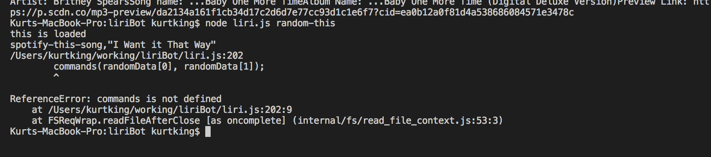

# liriBot
hw10

	      ***Please enter one of the following commands: 'movie-this', 'spotify-this-song', 'bands-this', 'random-this' followed by parameter ******

         *** use the command line to input what you wnould like to search ****

         ***** it will use the switch cases to go into the function to provide you with the information you are looking for *****

         **** your results will be logged in a log.txt file****

* screen shot of the log*

* screen shot of bands working*

* screen shot of movie working*

* screen shot of spotify working*

* screen shot of random working*
